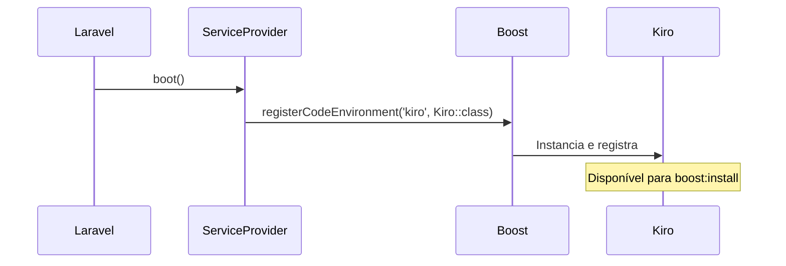
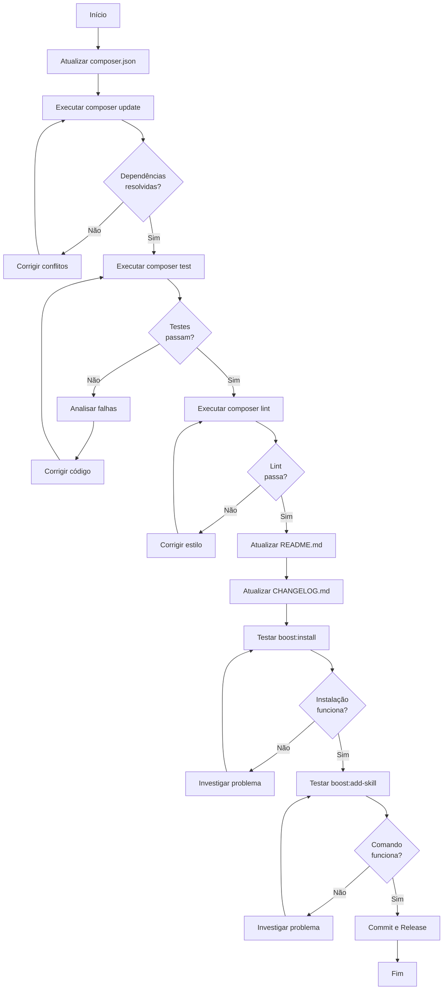

# Documento de Design

## Visão Geral

Este documento descreve o design para adequar o pacote "boost-for-kiro-ide" ao Laravel Boost v2.0. A atualização principal envolve mudança da dependência de `^1.0` para `^2.0` e verificação de compatibilidade com as novas funcionalidades introduzidas, especialmente o sistema de Skills. O pacote mantém sua função principal de registrar o Kiro IDE como um code environment no Laravel Boost, implementando as interfaces necessárias e configurando paths apropriados.

## Arquitetura

### Estrutura Atual do Pacote

```
boost-for-kiro-ide/
├── src/
│   ├── BoostForKiroServiceProvider.php
│   └── CodeEnvironment/
│       └── Kiro.php
├── tests/
├── composer.json
└── README.md
```

### Componentes Principais

1. **BoostForKiroServiceProvider**: Service Provider Laravel que registra o Kiro IDE no boot
2. **Kiro**: Classe que implementa CodeEnvironment, Agent e McpClient
3. **Composer.json**: Define dependências e configuração de auto-discovery

### Fluxo de Registro



## Componentes e Interfaces

### 1. Atualização de Dependência

**Componente**: `composer.json`

**Mudança Necessária**:
```json
{
  "require": {
    "php": "^8.1",
    "laravel/boost": "^2.0"
  }
}
```

**Justificativa**: A versão ^2.0 inclui o sistema de Skills e outras melhorias, mantendo compatibilidade com a API existente de code environments.

### 2. Verificação de Interfaces

**Componente**: `src/CodeEnvironment/Kiro.php`

**Interfaces Implementadas**:
- `Laravel\Boost\Install\CodeEnvironment\CodeEnvironment` (classe base abstrata)
- `Laravel\Boost\Contracts\Agent`
- `Laravel\Boost\Contracts\McpClient`

**Análise de Compatibilidade**:

Baseado na pesquisa realizada, o Laravel Boost v2.0 mantém as interfaces existentes para code environments. As mudanças principais são:

1. **Sistema de Skills**: É uma funcionalidade adicional que não requer mudanças em code environments existentes
2. **Skill Overrides**: Funcionalidade do usuário final, não afeta a implementação do code environment
3. **boost:add-skill**: Comando que funciona independentemente do code environment registrado

**Conclusão**: As interfaces Agent e McpClient permanecem compatíveis. Nenhuma mudança é necessária na implementação da classe Kiro.

### 3. Método de Registro

**Componente**: `src/BoostForKiroServiceProvider.php`

**Método Atual**:
```php
public function boot(): void
{
    Boost::registerCodeEnvironment('kiro', Kiro::class);
}
```

**Análise**: O método `Boost::registerCodeEnvironment()` é parte da API pública do Laravel Boost e permanece inalterado na v2.0. O sistema de Skills é uma camada adicional que não afeta o registro de code environments.

**Conclusão**: Nenhuma mudança necessária no ServiceProvider.

### 4. Paths de Configuração

**Componente**: Métodos de path na classe `Kiro`

**Paths Atuais**:
- MCP Config: `.kiro/settings/mcp.json`
- Guidelines: `.kiro/steering/laravel-boost.md`

**Análise**: Os paths são específicos do Kiro IDE e não dependem da versão do Laravel Boost. O Laravel Boost v2.0 não alterou a estrutura de diretórios esperada para code environments.

**Conclusão**: Nenhuma mudança necessária nos paths.

### 5. Sistema de Skills

**Nova Funcionalidade do Laravel Boost v2.0**

O sistema de Skills permite:
- Estender workflows de desenvolvimento
- Sobrescrever skills existentes
- Instalar skills de repositórios GitHub

**Estrutura de Skills**:
```
.ai/
├── skills/
│   └── skill-name/
│       └── SKILL.md
└── livewire/
    └── 3/
        └── skill/
            └── skill-name/
                └── SKILL.md
```

**Análise de Relevância para Code Environments**:

Skills são arquivos markdown com instruções de IA que o Laravel Boost carrega e disponibiliza para agentes. Eles são:
- Independentes de code environments
- Gerenciados pelo comando `boost:add-skill`
- Armazenados no diretório `.ai/` do projeto

**Conclusão**: Code environments como Kiro não precisam implementar suporte específico a skills. O sistema de skills funciona automaticamente uma vez que o code environment está registrado.

### 6. Detecção de Instalação

**Componente**: Métodos de detecção na classe `Kiro`

**Métodos Atuais**:
- `systemDetectionConfig(Platform $platform)`: Retorna paths de instalação por plataforma
- `projectDetectionConfig()`: Retorna `['.kiro']` para detecção de projetos

**Análise**: A lógica de detecção é parte da API de CodeEnvironment e não foi alterada no Laravel Boost v2.0.

**Conclusão**: Nenhuma mudança necessária nos métodos de detecção.

### 7. Configuração de Frontmatter

**Componente**: Método `frontmatter()` na classe `Kiro`

**Implementação Atual**:
```php
public function frontmatter(): bool
{
    return false;
}
```

**Análise**: O frontmatter YAML é usado para controlar quando guidelines são incluídas. O Kiro IDE não requer frontmatter, e essa configuração permanece válida na v2.0.

**Conclusão**: Nenhuma mudança necessária.

## Modelos de Dados

Não há modelos de dados neste pacote. O pacote apenas registra uma classe de configuração que implementa interfaces do Laravel Boost.

## Prework de Propriedades de Corretude

Agora vou analisar cada critério de aceitação dos requisitos para determinar sua testabilidade:


## Reflexão sobre Propriedades

Após analisar todos os critérios de aceitação testáveis, identifiquei as seguintes redundâncias e consolidações:

**Redundâncias Identificadas**:

1. **Testes de Interface (2.1, 2.2, 2.3)**: Os critérios 2.1 e 2.2 testam compilação de interfaces, enquanto 2.3 testa execução. O critério 2.3 (property) subsume 2.1 e 2.2, pois se os métodos executam corretamente, as interfaces estão implementadas corretamente.

2. **Testes de Path (4.1, 4.2, 4.3)**: Os critérios 4.1 e 4.2 testam retorno de métodos, enquanto 4.3 testa a criação real de arquivos. O critério 4.3 é mais abrangente e valida tanto os paths quanto a funcionalidade completa.

3. **Testes de Detecção (7.1, 7.2, 7.3)**: O critério 7.3 (teste end-to-end) valida que a detecção funciona completamente, incluindo os paths retornados por 7.1 e 7.2.

4. **Testes de Suite (9.1, 9.2, 9.4)**: Estes três critérios testam a execução da suite de testes. Podem ser consolidados em um único teste que executa toda a suite.

5. **Testes de Instalação (11.1, 11.2, 11.3)**: Estes três critérios testam o fluxo completo de instalação. Podem ser consolidados em um único teste end-to-end.

**Propriedades Mantidas Após Consolidação**:

- Property 1: Métodos de interface executam corretamente (consolida 2.1, 2.2, 2.3)
- Example 1: Dependência do composer.json está correta (1.1)
- Example 2: Composer update resolve dependências (1.2)
- Example 3: ServiceProvider registra sem erros (3.1)
- Example 4: boost:install lista Kiro IDE (3.2)
- Example 5: boost:install cria arquivos nos paths corretos (consolida 4.1, 4.2, 4.3)
- Example 6: boost:add-skill executa com Kiro registrado (6.1)
- Example 7: boost:install detecta Kiro IDE automaticamente (consolida 7.1, 7.2, 7.3)
- Example 8: Frontmatter retorna false (8.1)
- Example 9: Suite de testes passa completamente (consolida 9.1, 9.2, 9.4)
- Example 10: README contém Laravel Boost ^2.0 (10.1)
- Example 11: CHANGELOG contém entrada de versão (10.4)
- Example 12: Instalação completa funciona end-to-end (consolida 11.1, 11.2, 11.3)
- Example 13: Auto-discovery registra ServiceProvider (12.1)
- Example 14: boost:install lista Kiro IDE após instalação (12.3)

## Propriedades de Corretude

*Uma propriedade é uma característica ou comportamento que deve ser verdadeiro em todas as execuções válidas de um sistema - essencialmente, uma declaração formal sobre o que o sistema deve fazer. Propriedades servem como ponte entre especificações legíveis por humanos e garantias de corretude verificáveis por máquina.*

### Property 1: Métodos de Interface Executam Corretamente

*Para qualquer* instância da classe Kiro, chamar qualquer método definido pelas interfaces Agent, McpClient ou CodeEnvironment deve executar sem lançar exceções e retornar valores válidos do tipo esperado.

**Valida: Requisitos 2.3**

### Example 1: Dependência do Composer.json

Quando o arquivo composer.json é lido, ele deve conter a dependência `"laravel/boost": "^2.0"`.

**Valida: Requisitos 1.1**

### Example 2: Composer Update Resolve Dependências

Quando o comando `composer update` é executado em um ambiente limpo, ele deve completar com código de saída 0 (sucesso) e resolver todas as dependências sem conflitos.

**Valida: Requisitos 1.2**

### Example 3: ServiceProvider Registra Sem Erros

Quando o método `boot()` do BoostForKiroServiceProvider é chamado, ele deve executar `Boost::registerCodeEnvironment('kiro', Kiro::class)` sem lançar exceções.

**Valida: Requisitos 3.1**

### Example 4: boost:install Lista Kiro IDE

Quando o comando `php artisan boost:install` é executado, a saída deve incluir "Kiro" ou "kiro" como uma opção de code environment disponível.

**Valida: Requisitos 3.2**

### Example 5: boost:install Cria Arquivos nos Paths Corretos

Quando o comando `php artisan boost:install` é executado e o Kiro IDE é selecionado, os seguintes arquivos devem ser criados:
- `.kiro/settings/mcp.json`
- `.kiro/steering/laravel-boost.md`

**Valida: Requisitos 4.1, 4.2, 4.3**

### Example 6: boost:add-skill Executa com Kiro Registrado

Quando o Kiro IDE está registrado como code environment e o comando `php artisan boost:add-skill` é executado com um repositório válido, o comando deve completar sem erros.

**Valida: Requisitos 6.1**

### Example 7: boost:install Detecta Kiro IDE Automaticamente

Quando o Kiro IDE está instalado em um dos paths especificados por `systemDetectionConfig()` ou quando um diretório `.kiro` existe no projeto, o comando `php artisan boost:install` deve detectar e listar o Kiro IDE automaticamente.

**Valida: Requisitos 7.1, 7.2, 7.3**

### Example 8: Frontmatter Retorna False

Quando o método `frontmatter()` da classe Kiro é chamado, ele deve retornar `false`.

**Valida: Requisitos 8.1**

### Example 9: Suite de Testes Passa Completamente

Quando os comandos `composer test` e `composer lint` são executados, ambos devem completar com código de saída 0 (sucesso), indicando que todos os testes unitários passam e todas as verificações de análise estática são bem-sucedidas.

**Valida: Requisitos 9.1, 9.2, 9.4**

### Example 10: README Contém Laravel Boost ^2.0

Quando o arquivo README.md é lido, ele deve conter a string "Laravel Boost" seguida de "^2.0" ou "2.0" ou "2.x" na seção de requisitos ou compatibilidade.

**Valida: Requisitos 10.1**

### Example 11: CHANGELOG Contém Entrada de Versão

Quando o arquivo CHANGELOG.md é lido, ele deve conter uma entrada para a atualização do Laravel Boost v2.0, incluindo a data e descrição das mudanças.

**Valida: Requisitos 10.4**

### Example 12: Instalação Completa Funciona End-to-End

Quando o comando `php artisan boost:install` é executado em um projeto Laravel limpo com o pacote instalado, e o Kiro IDE é selecionado, o processo deve:
1. Apresentar o Kiro IDE como opção
2. Criar todos os arquivos de configuração necessários
3. Exibir mensagem de sucesso
4. Completar sem erros

**Valida: Requisitos 11.1, 11.2, 11.3**

### Example 13: Auto-discovery Registra ServiceProvider

Quando o pacote é instalado via Composer em um projeto Laravel, o BoostForKiroServiceProvider deve ser automaticamente registrado pelo sistema de auto-discovery do Laravel, sem necessidade de configuração manual em `config/app.php`.

**Valida: Requisitos 12.1**

### Example 14: boost:install Lista Kiro IDE Após Instalação

Quando o pacote é instalado via Composer e o comando `php artisan boost:install` é executado, o Kiro IDE deve aparecer na lista de code environments disponíveis.

**Valida: Requisitos 12.3**

## Tratamento de Erros

### Erros de Dependência

**Cenário**: Laravel Boost v2.0 não está instalado ou há conflito de versões.

**Tratamento**: 
- O Composer deve reportar erro claro sobre conflito de dependências
- Mensagem deve indicar que Laravel Boost ^2.0 é necessário
- Sugerir comando `composer update laravel/boost`

### Erros de Interface

**Cenário**: Interfaces do Laravel Boost foram modificadas de forma incompatível.

**Tratamento**:
- Análise estática (PHPStan) deve detectar incompatibilidades
- Testes unitários devem falhar com mensagens claras
- Documentação deve ser atualizada com instruções de migração

### Erros de Registro

**Cenário**: Método `Boost::registerCodeEnvironment()` não existe ou foi alterado.

**Tratamento**:
- ServiceProvider deve lançar exceção clara
- Testes devem detectar a falha no boot
- Logs devem indicar o problema de registro

### Erros de Path

**Cenário**: Paths de configuração não podem ser criados (permissões, etc).

**Tratamento**:
- Laravel Boost deve reportar erro de criação de arquivo
- Mensagem deve indicar path problemático
- Sugerir verificação de permissões

### Erros de Detecção

**Cenário**: Kiro IDE não é detectado mesmo estando instalado.

**Tratamento**:
- Usuário pode selecionar manualmente durante `boost:install`
- Documentação deve listar paths de detecção
- Sugerir verificação de instalação do Kiro

## Estratégia de Testes

### Abordagem Dual de Testes

Este projeto utilizará uma combinação de testes unitários e testes baseados em propriedades:

- **Testes Unitários**: Verificam exemplos específicos, casos extremos e condições de erro
- **Testes Baseados em Propriedades**: Verificam propriedades universais através de múltiplas entradas

Ambos são complementares e necessários para cobertura abrangente.

### Configuração de Testes

**Framework de Testes**: Pest PHP (já configurado no projeto)

**Análise Estática**: PHPStan (já configurado no projeto)

**Linting**: Laravel Pint (já configurado no projeto)

### Testes Unitários

Os testes unitários devem focar em:

1. **Exemplos Específicos**:
   - Verificar conteúdo do composer.json
   - Verificar retorno de métodos de path
   - Verificar retorno de método frontmatter
   - Verificar conteúdo de README e CHANGELOG

2. **Casos Extremos**:
   - Diferentes plataformas (macOS, Linux, Windows)
   - Diferentes versões do Laravel (10.x, 11.x, 12.x)
   - Diferentes versões do PHP (8.1, 8.2, 8.3)

3. **Condições de Erro**:
   - Interfaces não implementadas corretamente
   - Métodos lançando exceções
   - Paths inválidos

### Testes Baseados em Propriedades

**Biblioteca**: Não aplicável para este projeto específico, pois a maioria dos testes são exemplos concretos ou testes de integração.

**Justificativa**: O pacote é principalmente uma camada de configuração e registro. A única propriedade identificada (Property 1) pode ser testada adequadamente com testes unitários que verificam cada método das interfaces.

### Testes de Integração

Os testes de integração devem verificar:

1. **Integração com Laravel Boost**:
   - Executar `boost:install` em ambiente de teste
   - Verificar criação de arquivos
   - Verificar listagem de code environments

2. **Integração com Composer**:
   - Executar `composer update` em ambiente limpo
   - Verificar resolução de dependências
   - Verificar auto-discovery do ServiceProvider

3. **Integração com Laravel**:
   - Verificar boot do ServiceProvider
   - Verificar registro do code environment
   - Verificar disponibilidade de comandos Artisan

### Estrutura de Testes

```
tests/
├── Unit/
│   ├── KiroCodeEnvironmentTest.php
│   ├── ServiceProviderTest.php
│   └── ConfigurationTest.php
├── Integration/
│   ├── BoostInstallTest.php
│   ├── ComposerTest.php
│   └── LaravelIntegrationTest.php
└── Pest.php
```

### Cobertura de Testes

**Meta de Cobertura**: 90%+ de cobertura de código

**Áreas Críticas** (100% de cobertura):
- Classe Kiro (todos os métodos)
- BoostForKiroServiceProvider (método boot)

**Áreas de Menor Prioridade**:
- Documentação (verificação manual)
- Testes de integração end-to-end (podem ser executados manualmente)

### Execução de Testes

**Comandos**:
```bash
# Executar todos os testes
composer test

# Executar análise estática
composer lint

# Executar testes com cobertura
./vendor/bin/pest --coverage

# Executar apenas testes unitários
./vendor/bin/pest --testsuite=Unit

# Executar apenas testes de integração
./vendor/bin/pest --testsuite=Integration
```

### Automação de Testes

**CI/CD**: Os testes devem ser executados automaticamente em:
- Pull requests
- Commits na branch principal
- Releases

**Matriz de Testes**:
- PHP 8.1, 8.2, 8.3
- Laravel 10.x, 11.x, 12.x
- Laravel Boost 2.x

### Documentação de Testes

Cada teste deve incluir:
- Comentário descrevendo o que está sendo testado
- Referência ao requisito validado
- Exemplo de uso quando aplicável

**Formato**:
```php
/**
 * Testa que o método mcpConfigPath retorna o path correto.
 * 
 * Valida: Requisitos 4.1
 */
test('mcpConfigPath returns correct path', function () {
    $kiro = new Kiro();
    expect($kiro->mcpConfigPath())->toBe('.kiro/settings/mcp.json');
});
```

## Resumo das Mudanças Necessárias

Baseado na análise completa, as seguintes mudanças são necessárias:

### 1. Atualização de Dependência (Obrigatória)

**Arquivo**: `composer.json`

**Mudança**:
```json
"require": {
    "php": "^8.1",
    "laravel/boost": "^2.0"
}
```

### 2. Atualização de Documentação (Obrigatória)

**Arquivo**: `README.md`

**Mudanças**:
- Atualizar seção de requisitos para especificar Laravel Boost ^2.0
- Adicionar nota sobre compatibilidade com sistema de Skills
- Mencionar comando `boost:add-skill` (funciona automaticamente)
- Atualizar seção de compatibilidade

**Arquivo**: `CHANGELOG.md`

**Mudanças**:
- Adicionar entrada para nova versão
- Listar atualização para Laravel Boost v2.0
- Mencionar compatibilidade verificada com sistema de Skills

### 3. Verificação de Testes (Obrigatória)

**Ação**: Executar suite de testes completa com Laravel Boost v2.0

**Comandos**:
```bash
composer update
composer test
composer lint
```

### 4. Nenhuma Mudança de Código Necessária

**Conclusão**: A análise confirma que:
- As interfaces Agent e McpClient permanecem compatíveis
- O método `Boost::registerCodeEnvironment()` permanece inalterado
- Os paths de configuração permanecem válidos
- A detecção de instalação permanece funcional
- O sistema de Skills funciona automaticamente sem mudanças no code environment

## Diagrama de Fluxo de Adequação



## Considerações de Compatibilidade

### Versões Suportadas

**PHP**: 8.1, 8.2, 8.3

**Laravel**: 10.x, 11.x, 12.x

**Laravel Boost**: ^2.0

### Retrocompatibilidade

Este pacote **não** manterá compatibilidade com Laravel Boost v1.x após a atualização. Usuários que precisam de Laravel Boost v1.x devem usar a versão anterior do pacote.

### Migração para Usuários

Usuários existentes devem:

1. Atualizar o pacote: `composer update jcf/boost-for-kiro-ide`
2. Atualizar Laravel Boost: `composer update laravel/boost`
3. Re-executar instalação: `php artisan boost:install`
4. Verificar arquivos de configuração em `.kiro/`

### Sistema de Skills

O sistema de Skills do Laravel Boost v2.0 funciona automaticamente com o Kiro IDE registrado. Usuários podem:

- Instalar skills: `php artisan boost:add-skill owner/repo`
- Sobrescrever skills: Criar arquivos em `.ai/skills/`
- Skills são carregados automaticamente pelo Laravel Boost

Nenhuma configuração adicional é necessária no pacote boost-for-kiro-ide.
